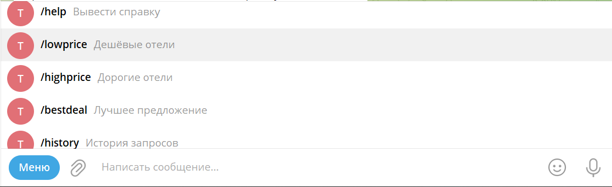
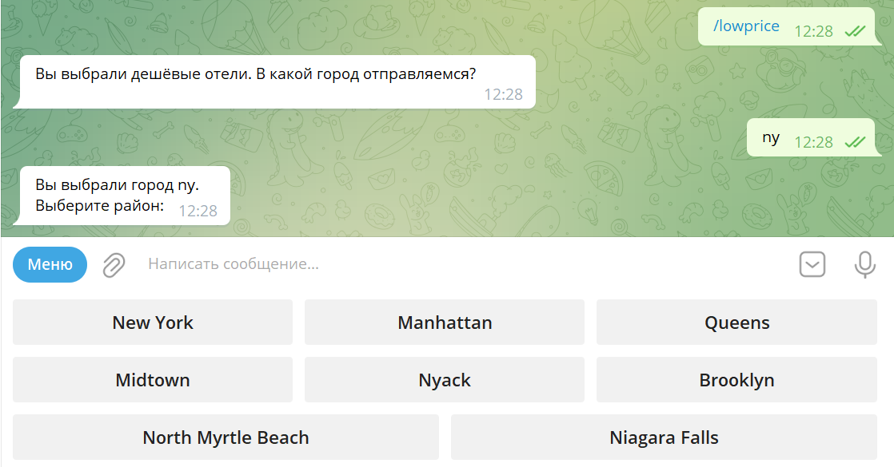
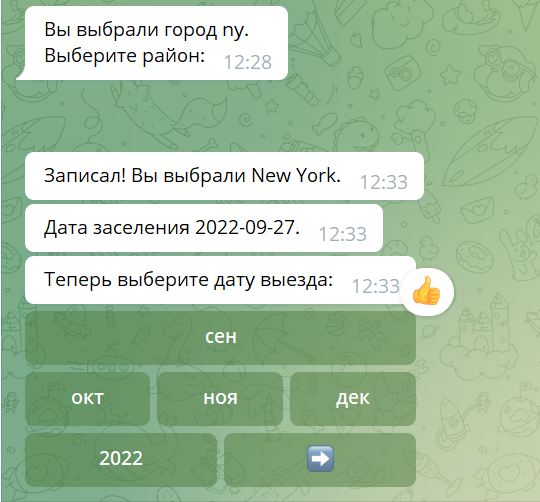
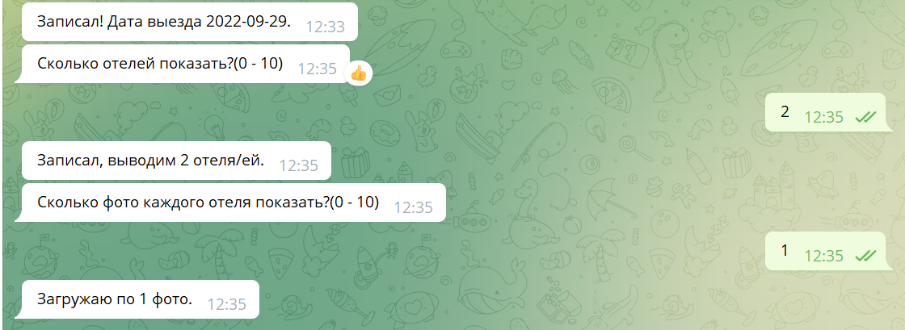
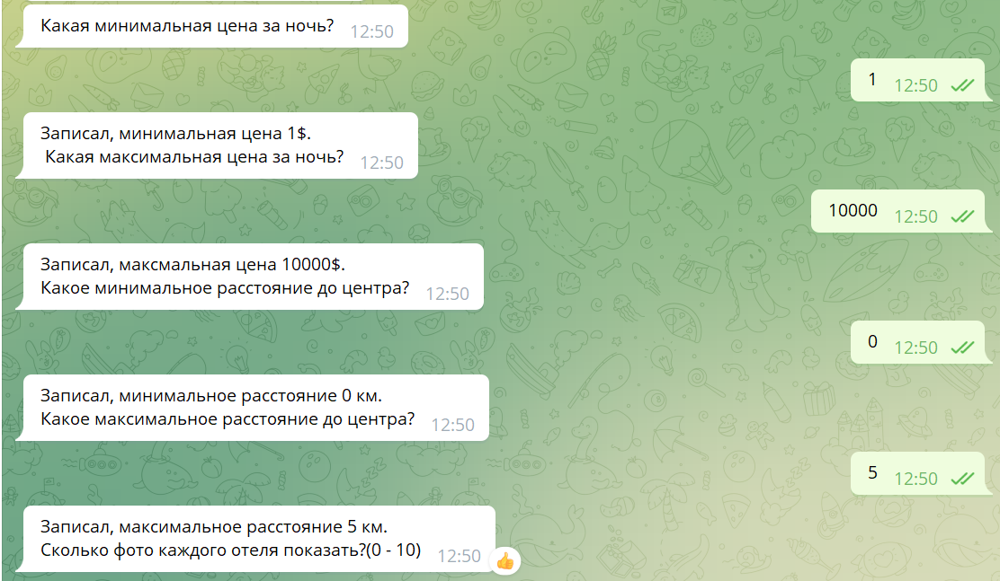
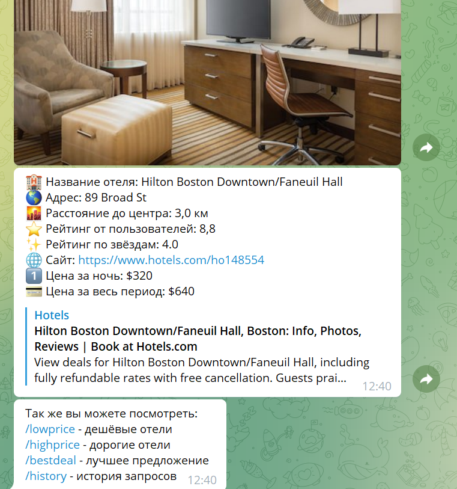
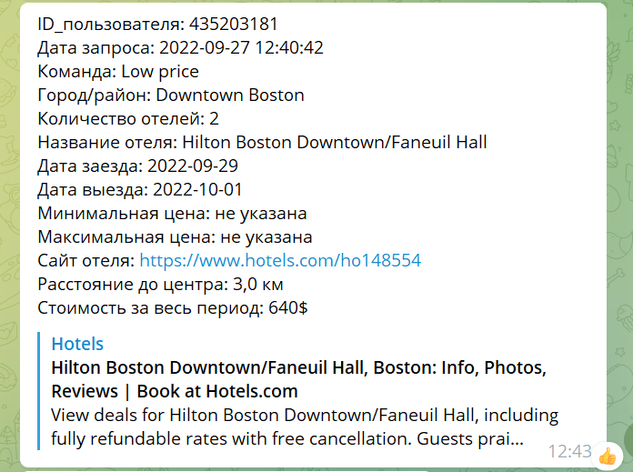

# Телеграмм-бот для поиска жилья.
В данном проекте представлен телеграмм-бот для сайта турагентства Too Easy Travel, предназначенный для поиска жилья.

## Начало работы
Для запуска бота необходим установленный интерпретатор Python версии 3.9.
Для работы бота необходимо дополнительно установить библиотеки «Requests», «pyTelegramBotAPI», «python-telegram-bot-calendar» и «python-dotenv».
```
pip instal Requests
pip instal pyTelegramBotAPI
pip instal python-telegram-bot-calendar
pip python-dotenv
```
Список необходимых библиотек так же представлен в «requirements.txt».
Нужен файл .env куда нужно сохранить RAPIDAPI_KEY и токен от вашего бота.
Бот использует API "rapidapi.com". Для работы с БД используется sqlite3.

### Состав
Бот состоит из следующих модулей:
1. «commands» - содержит обработчики команд бота.
2. «config_data» – содержит конфигурационные настройки, такие как API key, token для telegram бота и остальные настройки.
3. «dbworker» - содержит процедуры для работы с БД.
4. «getting_info» - основной модуль. Содержит процедуры для анализа ответов пользователя и вывода результатов в чат.
5. «keyboards» - модуль для создания виртуальной клавиатуры.
6. «states» - содержит состояния работы с пользователем.
7. «users_info_storage» - модуль для создания словаря временного хранения данных вводимых пользователем.
8. «utils» - содержит утилиты, в данном случае предустановки команд для бота.
9. «work_with_api» - модуль для работы c API.
10. «.env.template» - пример токена бота и ключа к API.
11. «db_history.db» - файл базы данных, необязателен.
12. «load_bot.py» - модуль для загрузки бота.
13. «main.py» - модуль для запуска бота.

## Пример работы бота
Бот запускается из файла «main.py». 

### После запуска есть 2 варианта начала работы с ботом:

Через команду «/start»:


Через всплывающее меню в телеграмме:


### Далее происходит получения от пользователя информации об искомом жилье.

После выбора ценовой категории пользователю предлагается ввести название города и после выбрать один из его районов:


После выбора района пользователь с помощью календаря выбирает дату заселения и дату выселения:


Далее пользователь выбирает выводимое количество отелей и фотографий каждого отеля:


Однако если пользователь выбрал команду «/bestdeal», то ему будет предложено ввести диапазон цены в долларах США и диапазон расстояния до центра выбранного города.


После чего пользователю выводится информация об отеле в данном формате и после предлагается выполнить ещё какое-либо действие.


## Команда «/history».
После ввода данной команды пользователю будет выведена история его запросов.


## Команда «/help».
Данная команда при её использовании выведет пользователю справку о возможных действиях с ботом.


## Автор проекта
Верещагин Евгений Вадимович - студент онлайн курсов 'Skillbox'.
